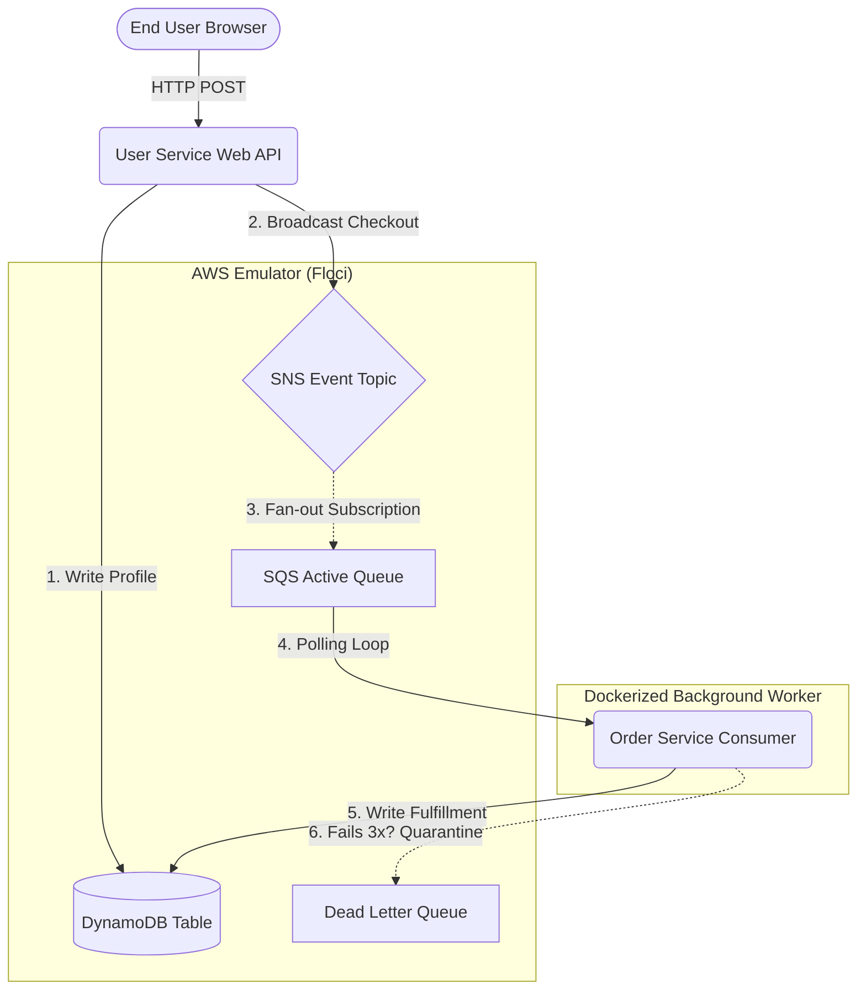

<div align="center">
  <h1>🚀 Event-Driven Microservice Architecture</h1>
  <p><strong>A production-ready, fully containerized Pub/Sub architecture simulating an eCommerce checkout flow using AWS, Terraform, Docker, and Python.</strong></p>
  
  [](https://www.python.org)
  [](https://www.docker.com/)
  [](https://www.terraform.io/)
  [](https://aws.amazon.com/)
  [](https://flask.palletsprojects.com/)
  [](https://developer.mozilla.org/en-US/docs/Web/HTML)
  [](https://developer.mozilla.org/en-US/docs/Web/CSS)
  [](https://developer.mozilla.org/en-US/docs/Web/JavaScript)
</div>

---

## 🏗️ Architecture & Flow

This project demonstrates a decoupled, highly resilient microservice mesh featuring a synchronous HTTP web frontend, asynchronous pub/sub event broadcasting, a shared NoSQL database tier, and a fault-tolerant Dead Letter Queue (DLQ) quarantine system.



### 🛰️ Core Component Breakdowns
1. **User Service (Flask Web API)**: Serves a modern HTML/CSS/JS frontend. When a user checks out, it writes their profile to DynamoDB and broadcasts a `USER_CHECKOUT` event to an SNS topic.
2. **SNS Broadcast Topic**: Decouples the frontend entry point from backend operations via an event-driven pub/sub mesh. It doesn't know who is listening, it just shouts the event to the cloud.
3. **SQS Resilient Queue**: Subscribed to the SNS topic. It buffers event payloads asynchronously to absorb high traffic spikes, holding them safely until a worker is ready.
4. **Order Service (Python Worker)**: A background loop constantly polling SQS. When an order arrives, it parses the data, fulfills the order, logs a success receipt back into DynamoDB, and deletes the message.
5. **Dead Letter Queue (DLQ)**: A fault-tolerant circuit breaker pattern. If a poison message crashes the worker 3 times (`maxReceiveCount = 3`), AWS automatically quarantines it into the DLQ to prevent infinite crash loops.

---

## ⚙️ Quick Start Guide

You can run this entire enterprise-grade architecture on your local machine using just a few commands.

### Prerequisites
- Docker & Docker Compose
- Terraform

### 1. Boot the Architecture
This command uses `docker-compose` to simultaneously launch the AWS Cloud Emulator (`floci`), the Frontend Web API, and the Background Worker in an isolated container network.
```bash
sudo docker-compose up -d --build
```

### 2. Provision the Infrastructure
Wait ~10 seconds for the cloud emulator to boot, then use Terraform to automatically create the DynamoDB tables, SNS topics, SQS queues, and IAM routing policies.
```bash
terraform init
terraform apply -auto-approve
```

### 3. Test It Out!
Open your web browser and navigate to the frontend portal:
👉 **[http://localhost:5000](http://localhost:5000)**

You can watch the backend microservices talk to each other in real-time by streaming the unified docker logs in your terminal:
```bash
sudo docker-compose logs -f
```

---

## ☠️ The "Poison Pill" Feature
To demonstrate the fault-tolerance of the architecture, I built a trap to test the Dead Letter Queue.
1. Go to the web frontend and change your User ID to **`CRASH`**.
2. Click Checkout.
3. Watch the Docker logs: The Order Service will intentionally throw a fatal error. After AWS detects 3 consecutive worker crashes, it will automatically pull the toxic message out of the main queue and quarantine it into the DLQ, ensuring the system remains stable!

---

## 🧹 Teardown
To cleanly destroy the infrastructure and stop the background containers, run:
```bash
sudo docker-compose down
```